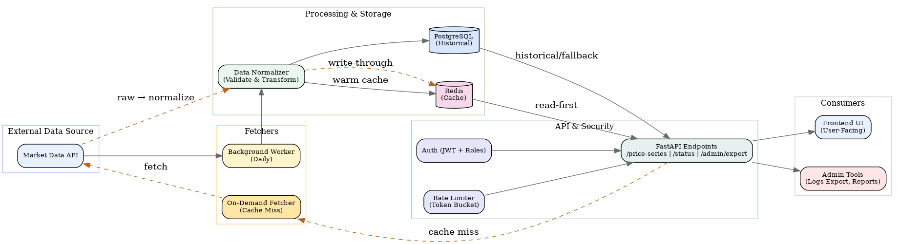

# Crypto Data Backend — FastAPI · Redis · PostgreSQL

I built a backend service to fetch, normalize, and serve cryptocurrency market data.  
The system had to integrate with multiple external providers, cache responses, store history, and remain secure under rate limits.

This is a write-up of the architecture, technical details, and lessons learned.

---

## 🔹 The Challenge

The backend needed to:  

- Fetch data daily and normalize it into a consistent schema.  
- Provide endpoints for both simple and time-series queries.  
- Cache results in Redis for sub-200ms responses.  
- Secure requests with API keys and JWT-based auth.  
- Rate-limit users to protect upstream APIs.  
- Give admins visibility into logs.  

---

## 🔹 Architecture

The design ended up as a layered flow:

- **External Data Sources**  
  These were public crypto APIs that returned JSON data. Each API had small quirks (field names, formats), so I couldn’t just plug them in directly.  

- **Fetchers**  
  I had two paths for bringing in data:  
  - A **background worker** that ran daily, pulled data in bulk, normalized it, and saved into both Postgres and Redis.  
  - An **on-demand fetcher** that only ran when Redis didn’t have the data. It fetched fresh data, normalized it, and immediately updated Redis before returning the result.  

- **Normalizer**  
  This was the translator of the system. Since every API returned JSON in slightly different shapes, I used Pydantic models to validate and reshape everything into a consistent schema. This prevented errors and made downstream querying predictable.  

- **PostgreSQL**  
  This acted as the long-term memory. All normalized data was stored here for historical queries. The schema was simple (asset + date + price) but ensured consistency for analytics.  

- **Redis**  
  Redis was the short-term memory — a fast cache with 24h TTLs. Keys were structured like `asset:currency:interval:days`. I implemented it as a **read-through cache**: if a key was missing, the fetcher grabbed data and Redis was updated immediately.  

- **FastAPI Endpoints**  
  The service exposed three main endpoints:  
  - `/simple_price` → fetch latest price(s).  
  - `/market_chart` → fetch historical time-series data.  
  - `/logs/export` → admin-only endpoint to download structured logs.  
  FastAPI’s input validation caught invalid parameters (like wrong `days` values) before they hit the backend logic.  

- **Authentication & Access Control**  
  Security was handled with API keys and JWT:  
  - **Private API key** for normal requests.  
  - **Admin key** for privileged routes (like log export).  
  - I also added **JWT auth** at the FastAPI layer for role-based access control (future-ready).  
  The client didn’t want to share his private key with me during testing, so I built and tested the entire flow using public keys and Postman. This allowed me to validate auth, caching, and endpoint behavior without exposing secrets.  

- **Rate Limiting**  
  To prevent overload, I added a Redis-based token bucket. Each request consumed a token, and when tokens ran out, further requests were rejected until refill. This ensured fair usage and kept us under upstream API quotas.  

- **Consumers**  
  The final users of this system were:  
  - A **frontend UI**, which called the `/simple_price` and `/market_chart` endpoints to display charts.  
  - **Admin tools**, which consumed `/logs/export` for debugging and auditing.  

---

## 🔹 Technical Details

- **Background Scheduling**  
  The background worker ran once daily on a cron schedule. It ensured data stayed fresh without hammering upstream APIs unnecessarily.  

- **Validation Rules**  
  - `days` could only be an integer or `"max"`.  
  - `interval` was restricted to `daily` or `hourly`.  
  - `currency` values came from a predefined whitelist.  
  This avoided invalid queries from reaching cache or external APIs.  

- **Redis Keys & Policy**  
  Cache keys were structured as `asset:currency:interval:days`.  
  Entries had a TTL of 24 hours, refreshed daily by the worker. Cache misses triggered on-demand fetches that also wrote into Redis.  

- **Error Handling**  
  External API failures weren’t ignored. I used retries with exponential backoff to handle transient errors gracefully.  

- **Log Export**  
  All API calls and worker actions were logged in structured format. Admins could export these logs via `/logs/export`. Logs were rotated and compressed to keep file sizes manageable.  

- **Testing Setup**  
  - **Unit tests** validated query parameters and schema checks.  
  - **Integration tests** spun up Redis and Postgres containers, letting me simulate the whole system end-to-end.  
  Since I didn’t have the client’s private key, I used public keys + Postman to mimic real calls. This let me test the design thoroughly without production secrets.  

---

## 🔹 Learnings

- Normalization was non-negotiable. Different APIs would have made the system chaotic without a translation layer.  
- Redis caching wasn’t just an optimization — it was essential for sub-200ms responses.  
- Hybrid auth (API keys + JWT) gave me both simplicity and forward-compatibility.  
- Admin log export, though small, turned into one of the most useful features for debugging.  
- Strict validation paid off by cutting off bad requests before they caused bigger problems.  

---

## 🔹 Reflection

What started as a “fetch and serve” idea became a proper microservice.  
By layering fetchers, normalization, caching, and security, the system became reliable, predictable, and easy to extend.  

The big lessons for me: **normalize early, cache aggressively, validate strictly, and always give admins visibility.**
